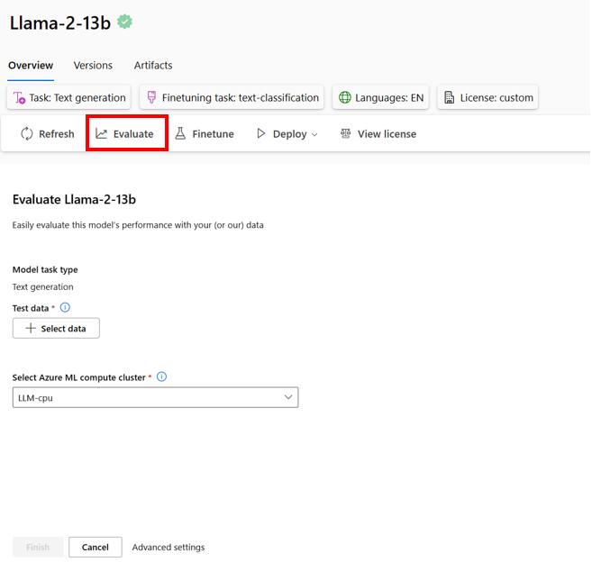
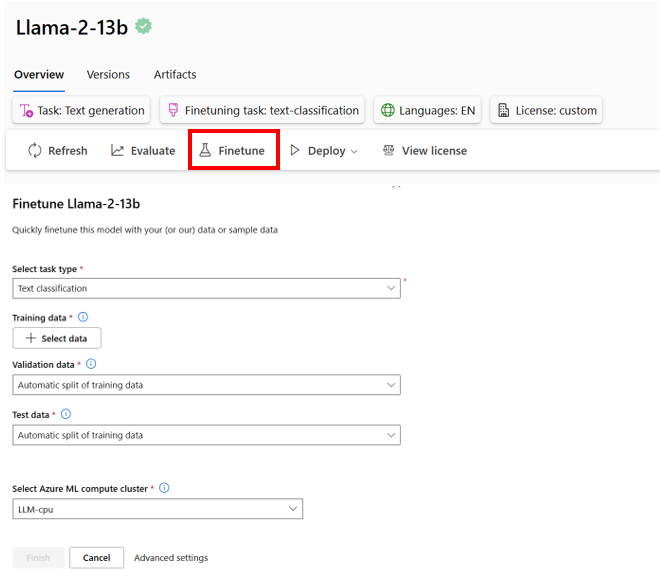
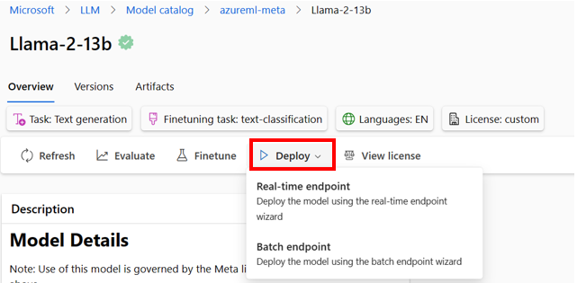
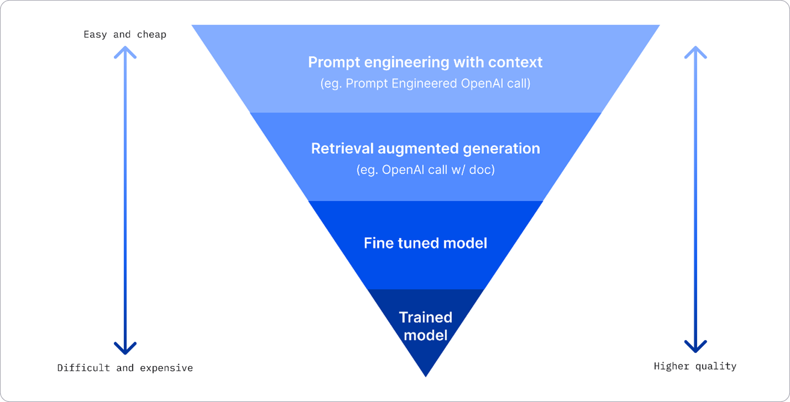

# Exploring and comparing different LLMs

## Introduction

With the previous lesson, we have seen how Generative AI is changing the technology landscape, how Large Language Models (LLMs) work and how a business - like the Edu4All startup - can apply them to their use cases and grow!

The next step in the Edu4All team journey is exploring the current landscape of Large Language Models and understanding what are the most suitable for their use cases.

This lesson will cover:

- Different types of LLMs in the current landscape
- Testing, iterating, and comparing different models for your use case in Azure
- Deploying your LLM

## Learning Goals

After completing this lesson, you will be able to:
- Select the right model for your use case
- Understand how to test, iterate, and improve performance
- Know how Business deploy models

## Understand different types of LLMs 

Large Language Models (LLMs) can have multiple categorizations based on their architecture, training data, and use case. Knowing this will help the Education Startup team to select the right model for the scenario, and understand how to test, iterate, and improve performance. 

### Foundation Models versus LLMs

The term Foundation Model was [coined by Stanford researchers](https://arxiv.org/abs/2108.07258) and defined as an AI model that follows some criteria, such as:
- They are trained using unsupervised learning or self-supervised learning, meaning they are trained on unlabeled multimodal data, and they do not require human annotation or labeling of data for their training process.
- They are very large models, based on very deep neural networks trained on billions of parameters.
- They are normally intended to serve as a ‘foundation’ for other models, meaning they can be used as a starting point for other models to be built on top of, which can be done by fine-tuning.
Now, since foundation models have taken shape most strongly in the natural language processing domain, it’s common to use the terms foundation model and LLM interchangeably. However, to be precise, LLMs are a type of foundation model, usually trained on text data, that could be specialized for specific use cases, such as text summarization, translation, or question answering. In other words, not all foundation models are LLMs and LLMs can be seen as language-focused foundation models.

 
Image source: [Essential Guide to Foundation Models and Large Language Models | by Babar M Bhatti | Medium
](https://thebabar.medium.com/essential-guide-to-foundation-models-and-large-language-models-27dab58f7404) 

To further clarify this distinction, let’s take ChatGPT as an example. To build the first version of ChatGPT, a model called GPT-3.5 served as the foundation model. This means that OpenAI used some chat-specific data to create a tuned version of GPT-3.5 that was specialized in performing well in conversational scenarios, such as chatbots.

 
Image source: [2108.07258.pdf (arxiv.org)](https://arxiv.org/pdf/2108.07258.pdf)

### Open Source versus Proprietary Models

Another way to categorize LLMs is whether they are open source or proprietary.

Open-source models are models that are made available to the public and can be used by anyone. They are often made available by the company that created them, or by the research community. These models are allowed to be inspected, modified, and customized for the various use cases in LLMs. However, they are not always optimized for production use, and may not be as performant as proprietary models. Plus, funding for open-source models can be limited, and they may not be maintained for long periods of time or may not be updated with the latest research. Examples of popular open source models include [Alpaca](https://crfm.stanford.edu/2023/03/13/alpaca.html), [Bloom](https://sapling.ai/llm/bloom) and [LLaMA](https://sapling.ai/llm/llama).

Proprietary models are models that are owned by a company and are not made available to the public. These models are often optimized for production use. However, they are not allowed to be inspected, modified, or customized for different use cases. Plus, they are not always available for free, and may require a subscription or payment to use. Also, users do not have control over the data that is used to train the model, which means they should entrust the model owner with ensuring commitment about data privacy and responsible use of AI. Examples of popular proprietary models include [OpenAI models](https://platform.openai.com/docs/models/overview), [Google Bard](https://sapling.ai/llm/bard) or [Claude 2](https://www.anthropic.com/index/claude-2).

### Embedding versus Image generation versus Text and Code generation

LLMs can also be categorized by the output they generate.

Embeddings is a set of models that can convert text into a numerical form, called embedding, which is a numerical representation of the input text. Embeddings make it easier for machines to understand the relationships between words or sentences and can be consumed as inputs by other models, such as classification models, or clustering models that have better performance on numerical data. Embedding models are often used for transfer learning, where a model is built for a surrogate task for which there’s an abundance of data, and then the model weights (embeddings) are re-used for other downstream tasks. An example of this category is [OpenAI embeddings](https://platform.openai.com/docs/models/embeddings).

Image generation models are models that generate images. These models are often used for image editing, image synthesis, and image translation. Image generation models are often trained on large datasets of images, such as [LAION-5B](https://laion.ai/blog/laion-5b/), and can be used to generate new images, or to edit existing images with inpainting, super-resolution, and colorization techniques. Examples include [DALLE3](https://openai.com/dall-e-3) and [Stable Diffusion models](https://github.com/Stability-AI/StableDiffusion).

Text and code generation models are models that generate text or code. These models are often used for text summarization, translation, and question answering. Text generation models are often trained on large datasets of text, such as [BookCorpus](https://www.cv-foundation.org/openaccess/content_iccv_2015/html/Zhu_Aligning_Books_and_ICCV_2015_paper.html), and can be used to generate new text, or to answer questions. Code generation models, like [CodeParrot](https://huggingface.co/codeparrot), are often trained on large datasets of code, such as GitHub, and can be used to generate new code, or to fix bugs in existing code.

 

### Encoder-Decoder versus Decoder-only

To talk about the different types of architectures of LLMs, let's use an analogy. 

Imagine your manager gave you a task for writing a quiz for the students.  You have two colleagues; one oversees creating the content and the other oversees reviewing them.

The content creator is like a Decoder only model, he can look at the topic and see what you already wrote and then he can write a course based on that. He is very good at writing engaging and informative content, but he is not very good at understanding the topic and the learning objectives. Some examples of Decoder models are GPT family models, such as GPT-3.

The reviewer is like an Encoder only model, he looks at the course written and the answers, noticing the relationship between them and understanding context, but he is not good at generating content. An example of Encoder only model would be BERT.

Imagine that we can have someone as well who could create and review the quiz, this is an Encoder-Decoder model. Some examples would be BART and T5.

### Service versus Model

Now, let's talk about the difference between a service and a model. A service is a product that is offered by a Cloud Service Provider, and is often a combination of models, data, and other components. A model is the core component of a service, and is often a foundation model, such as an LLM. 

Services are often optimized for production use and are often easier to use than models, via a graphical user interface. However, services are not always available for free, and may require a subscription or payment to use, in exchange to leverage service owner’s equipment and resources, optimizing CapEx and scaling easily. An example of service is [Azure OpenAI service](https://learn.microsoft.com/azure/ai-services/openai/overview), which offers a pay-as-you-go rate plan,  meaning users are charged proportionally to how much they use the service Also, Azure OpenAI service offers enterprise-grade security and responsible AI framework on top of the models' capabilities.

Models are just the Neural Network, with the parameters, weights, and others. Allowing companies to run locally, however, would need to buy equipment, build structure to scale and buy a license or use an open-source model. A model like LLaMA is available to be used, requiring computational power to run the model.
 
## How to test and iterate with different models to understand performance on Azure 

Once the Edu4All team has explored the current LLMs landscape and identified some good candidates for their scenarios, the next step is testing them on their data and on their workload. This is an iterative process, done by experiments and measures.
Most of the models we mentioned in previous paragraphs (OpenAI models, open source models like Llama2, and Hugging Face transformers) are available in the [Foundation Models](https://learn.microsoft.com/en-us/azure/machine-learning/concept-foundation-models) catalog in [Azure Machine Learning studio](https://ml.azure.com/).

[Azure Machine Learning](https://azure.microsoft.com/en-us/products/machine-learning/) is a Cloud Service designed for data scientists and ML engineers to manage the whole ML lifecycle (train, test, deploy and handle MLOps) in a single platform. The Machine Learning studio offers a graphical user interface to this service and enables the user to:
-	Find the Foundation Model of interest in the catalog, filtering by task, license, or name. It’s also possible to import new models that are not yet included in the catalog.
-	Review the model card, including a detailed description and code samples, and test it with the Sample Inference widget, by providing a sample prompt to test the result.

 
-	Evaluate model performance with objective evaluation metrics on a specific workload and a specific set of data provided in input.

 
-	Fine-tune the model on custom training data to improve model performance in a specific workload, leveraging the experimentation and tracking capabilities of Azure Machine Learning. 

 
-	Deploy the original pre-trained model or the fine-tuned version to a remote real time inference or batch endpoint, to enable applications to consume it.

## Deploying LLMs

We’ve explored with the Edu4All team different kinds of LLMs and a Cloud Platform (Azure Machine Learning) enabling us to compare different models, evaluate them on test data, improve performance and deploy them on inference endpoints.

But when shall they consider fine-tuning a model rather than using a pre-trained one? Are there other approaches to improve model performance on specific workloads? 

There are several approaches a business can use to deploy an LLM in production, with different levels of complexity, cost, and quality. Let’s look at them.

 
Img source: [Four Ways that Enterprises Deploy LLMs | Fiddler AI Blog](https://www.fiddler.ai/blog/four-ways-that-enterprises-deploy-llms)

### Prompt Engineering with Context

Pre-trained LLMs work very well on generalized natural language tasks, even by calling them with a short prompt, like a sentence to complete or a question – the so-called “zero-shot” learning.
However, the more the user can frame their query, with a detailed request and examples – the Context – the most accurate and closest to user’s expectations the answer will be. In this case, we talk about “one-shot” learning if the prompt includes only one example and “few shot learning” if it includes multiple examples.
Prompt engineering with context is the most cost-effective approach to kick-off with.

### Retrieval Augmented Generation (RAG)

LLMs have the limitation that they can use only the data that has been used during their training to generate an answer. This means that they don’t know anything about the facts that happened after their training process, and they cannot access non-public information (like company data).
This can be overcome through RAG, a technique that augments prompt with external data in the form of chunks of documents, considering prompt length limits. This should be supported by Vector database tools (like [Azure Vector Search](https://learn.microsoft.com/en-us/azure/search/vector-search-overview)) that retrieve the useful chunks from varied pre-defined data sources and add them to the prompt Context.
This technique is very helpful when a business doesn’t have enough data, enough time, or resources to fine-tune an LLM, but still wishes to improve performance on a specific workload and reduce risks of hallucinations, i.e., mystification of reality or harmful content.  

### Fine-tuned model
Fine-tuning is a process that leverages transfer learning to ‘adapt’ the model to a downstream task or to solve a specific problem. Differently from few-shot learning and RAG, it results in a new model being generated, with updated weights and biases. It requires a set of training examples consisting of a single input (the prompt) and its associated output (the completion).
This would be the preferred approach if:
-	A business would like to use fine-tuned less capable models (like embedding models) rather than high performance models, resulting in a more cost effective and fast solution.
-	Latency is important for a specific use-case, so it’s not possible to use very long prompts or the number of examples that should be learnt from the model doesn’t fit with the prompt length limit.
-	A business has a lot of high-quality data and ground truth labels and the resources required to maintain this data up to date over time.
### Trained model
Training an LLM from scratch is without a doubt the most difficult and the most complex approach to adopt, requiring massive amounts of data, skilled resources, and appropriate computational power. This option should be considered only in a scenario where a business has a domain-specific use case and a large amount of domain-centric data.

## Additional resources
-	[The Large Language Model (LLM) Index | Sapling](https://sapling.ai/llm/index)
-	[[2304.04052] Decoder-Only or Encoder-Decoder? Interpreting Language Model as a Regularized Encoder-Decoder (arxiv.org)](https://arxiv.org/abs/2304.04052)
-	[How to use Open Source foundation models curated by Azure Machine Learning (preview) - Azure Machine Learning | Microsoft Learn](https://learn.microsoft.com/en-us/azure/machine-learning/how-to-use-foundation-models?view=azureml-api-2)
-	[Four Ways that Enterprises Deploy LLMs | Fiddler AI Blog](https://www.fiddler.ai/blog/four-ways-that-enterprises-deploy-llms)
