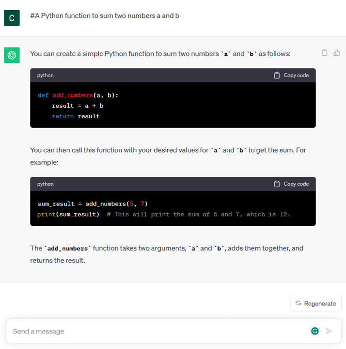

# 生成式人工智能和 LLM 介绍

*(点击该图片看导学视频)*

生成式人工智能是能够生成文本、图像和其他类型内容的人工智能。 它之所以成为一项出色的技术，是因为它使人工智能更通用化，任何人都可以使用它，只需简单文本提示，使用自然语言编写的提示词。 你不需要学习 Java 或 SQL 这样的语言来完成一些有价值的事情，你只需要使用你的日常语言，描述需要的东西，然后 LLMs 就会给出相关建议。 其应用场景和影响是巨大的，您可以在几秒钟内完成写作或理解报告、编写应用程序等。

在本课程中，我们将探讨我们的初创公司如何利用生成式人工智能来解锁教育界的新场景，以及如何利用生成式人工智能解决与该应用的社会影响和技术限制相关的不可避免的挑战。

## 概述

本课程将包含以下内容：

* 业务场景介绍：我们的创业理念和使命。
* 生成式人工智能以及我们如何适应当前的技术格局。
* LLMs 的内部工作原理。
* LLMs 的主要功能和实际用例。

## 学习目标

学习完本课程后，您将会了解到：

* 什么是生成式人工智能以及 LLMs 如何工作。
* 如何针对不同的使用 LLMs 的例子(这里我们重点关注教育场景)。

## 场景: our educational startup 

生成人工智能 (AI) 代表了人工智能技术的巅峰，突破了曾经被认为不可能的界限。 生成式人工智能模型具有多模态的功能，在本课程中，我们将会讲述一间虚构的初创公司利用生成式人工智能改变传统教育方式的故事。 我们将这家初创公司称为“Our startup”。 Our startup 致力于教育领域，其雄心勃勃的使命宣言是

> *在全球范围内提高学习的可及性，确保公平的受教育机会，并根据每个学习者的需求为他们提供个性化的学习体验*。

我们的初创团队意识到，如果不利用现代最强大的工具之—— LLM，我们将无法实现这一目标。

生成式人工智能有望彻底改变我们今天的学习和教学方式，学生可以每天 24 小时使用虚拟教师，虚拟教室不仅能提供大量信息和示例，也能够利用创新的工具来评估学生并提供反馈。

首先，让我们来学习一些将在整个课程系列中使用的基本概念和术语。

## 我们是如何获得生成式人工智能的？

尽管最近因生成人工智能模型的发布而引起了对人工智能技术的“炒作”，但人工智能已经有数十年的历史，最早的研究工作可以追溯到上世纪 60 年代。 我们现在正处于 AI 具有人类认知能力的阶段，例如 [OpenAI ChatGPT](https://openai.com/chatgpt) 或 [Bing Chat](https://www.microsoft.com/en-us/edge/features/bing-chat?WT.mc_id=academic-105485-koreyst）也在用 GPT 模型进行对话。

稍微回顾一下，人工智能的第一个原型是打字的聊天机器人，依赖于从一组专家系统中提取到计算机中的知识库。 知识库中的答案是由输入文本中出现的关键字触发的。
然而，很快大家就发现，这种使用打字聊天机器人的方法并不能很好地扩展。

### 人工智能的统计学：机器学习

随着统计学在文本分析中的应用，20 世纪 90 年代出现了一个转折点。 这导致了新算法的发展——被称为机器学习——能够从数据中学习的模式，不需要使用显式编程。 这种方法允许机器模拟人类语言理解：在文本标签配对上训练统计模型，使模型能够使用代表消息意图的预定义标签对未知输入文本进行分类。

### 神经网络和现代虚拟助手的出现

近年来，硬件技术的发展能够处理更大量的数据和更复杂的计算，让人工智能领域的研究得以加速，从而导致了更先进的机器学习算法（称为神经网络或深度学习算法）的发展。

神经网络（特别是循环神经网络 - RNN）显着增强了自然语言处理领域的应用，能够以更有意义的方式表示文本含义，并重视句子中单词的上下文之间的联系。

这项技术为新世纪第一个十年诞生的虚拟助手提供了动力，它们非常精通解释人类语言、识别需求并执行满足需求的操作，例如使用预定义的脚本进行回答或使用第三方服务。

### 今天 - 生成式人工智能的诞生

这就是我们今天提出生成式人工智能的原因，它可以被视为深度学习的一个子集。

经过人工智能领域数十年的研究，一种名为 *Transformer* 的新模型架构克服了 RNN 的限制，能够获得更长的文本序列作为输入。 Transformer 基于注意力机制，使模型能够为其接收到的输入赋予不同的权重，“更加专注于”关联信息集中的地方，不管它们在文本序列中的顺序如何。

生成式人工智能模也称为 LLM，因为它们使用文本输入和输出的架构。 这些模型的有趣之处在于，它们经过来自书籍、文章和网站等不同来源的大量未标记数据的训练，可以适应各种各样的任务，并以创造性的方式生成语法正确的文本。 因此，它们不仅极大地增强了机器“理解”输入文本的能力，而且使机器能够以人类语言生成原始响应。

## LLMs 如何工作?

在下一章中，我们将探索不同类型的生成式 AI 模型，但现在让我们看看大型语言模型是如何工作的，重点是 OpenAI GPT（生成式预训练 Transformer）模型。

* **分词器，文本到数字**：大型语言模型接收文本作为输入并生成文本作为输出。 然而，作为统计模型，它们对数字的处理效果对比起文本序列的处理效果要好得多。 这就是为什么模型的每个输入在被核心模型使用之前都由分词器处理。 标记是一段文本——由可变数量的字符组成，因此标记器的主要任务是将输入分割成标记数组。 然后，每个令牌都映射有一个令牌索引，该索引是原始文本块的整数编码。

* **预测输出标记**：给定 n 个标记作为输入（最大 n 因模型而异），模型能够预测一个标记作为输出。 然后，该标记会以扩展窗口模式合并到下一次迭代的输入中，从而获得一个（或多个）句子作为答案,生成结果有更好的用户体验。 这解释了为什么如果您曾经使用过 ChatGPT，您可能会注意到有时它在生成结果时在句子中间出现停顿。

* **选择过程，概率分布**：模型根据其在当前文本序列之后出现的概率来选择输出标记。 这是因为该模型预测了根据其训练计算出的所有可能的“下一个标记”的概率分布。 然而，并不总是从结果分布中选择概率最高的标记。 这种选择增加了一定程度的随机性，模型以非确定性方式运行——对于相同的输入，我们不会得到完全相同的输出。 添加这种程度的随机性是为了模拟人类创造性思维的过程，您可以使用称为温度的模型参数进行调整。

## “Our startup” 如何利用 LLMs ？

现在我们对 LLMs  的内部工作有了更好的了解，让我们看看它们可以很好地执行的最常见任务的一些实际示例，并着眼于我们的业务场景。
我们说过， LLMs  的主要功能是*从头开始生成文本，从文本输入开始，用自然语言编写*。

但是是什么样的文本输入和输出呢？
大型语言模型的输入称为提示，而输出称为补全，术语指的是生成下一个标记来完成当前输入的模型机制。 我们将深入探讨什么是提示以及如何设计它以充分和我们的模型进行交流。 但现在，我们假设提示可能包括：

* 通过一条**指令**，指定我们期望模型输出的类型。 该指令有时可能会嵌入一些示例或一些附加数据。

     1. 文章、书籍、产品评论等的总结，以及从非结构化数据中提取见解。
     

     2. 文章、论文、作业等的创意构思和设计。
     

* **问题**，以与代理对话的形式提出。
     

* **文本补全**，这隐含着对写作帮助的请求。
     

*  **代码**解释和记录需求，或者要求生成执行特定任务的一段代码的注释。
     

以上的例子非常简单，并不是对生成式人工智能功能的详尽演示。 只是想展示使用生成式人工智能的潜力，并不局限于教育领域。

此外，生成式人工智能模型的输出并不完美，有时模型的创造力可能会对其产生不利影响，导致输出是人类用户可以将其解释为现实神秘化的单词组合，或者具有攻击性。 生成式人工智能并不智能——至少在更全面的智能定义中是这样，包括批判性和创造性推理或情商； 它不是确定性的，也不值得信赖，因为错误的引用、内容和陈述等幻觉可能会与正确的信息结合起来，并以有说服力和自信的方式呈现。 在接下来的课程中，我们将处理所有这些限制，并了解可以采取哪些措施来降低影响。

## 任务

你的任务是阅读更多关于生成式人工智能（https://en.wikipedia.org/wiki/Generative_artificial_intelligence）的内容，并尝试找出一个你现在可以添加生成式人工智能但目前还没有的领域。 与用“旧式方法”做有什么不同，你能做一些你以前做不到的事情吗，或者生成的时候速度更快吗？ 写一篇 300 字的摘要，描述您梦想的人工智能初创公司的样子，包括“问题”、“我将如何使用人工智能”、“影响”等标题，还可以选择做一份商业计划。

如果您完成了此任务，您甚至可以准备好申请 Microsoft 的创业孵化器[Microsoft for Startups Founders Hub](https://www.microsoft.com/en-gb/startups)，我们为您提供 Azure 和 OpenAIc redits 以及相关指导等等

## 知识检查

大型语言模型的真实情况是什么？

1. 你每次都会得到完全相同的回应。
2. 它做得很完美，擅长添加数字、生成工作代码等
3. 尽管使用相同的提示，但响应可能会有所不同。 它还非常适合为您提供某些内容的初稿，无论是文本还是代码。 但你需要改进结果。

正确答案：3、LLM 是不确定性的，响应会有所不同，但是您可以通过温度设置来控制其输出。 你也不应该期望它能完美地完成事情，它是为你做繁重的工作的，这通常意味着你需要不断改进才能得到了良好的结果。

## 继续您的学习旅程

想要了解更多关于不同的生成人工智能概念吗？ 请到[进阶学习的页面](../13-continued-learning/README.md) 查找有关此主题的其他学习资源。

前往第二章，我们将了解如何[探索和比较不同的 LLM 类型](/02-exploring-and-comparing- different-llms/README.md)！